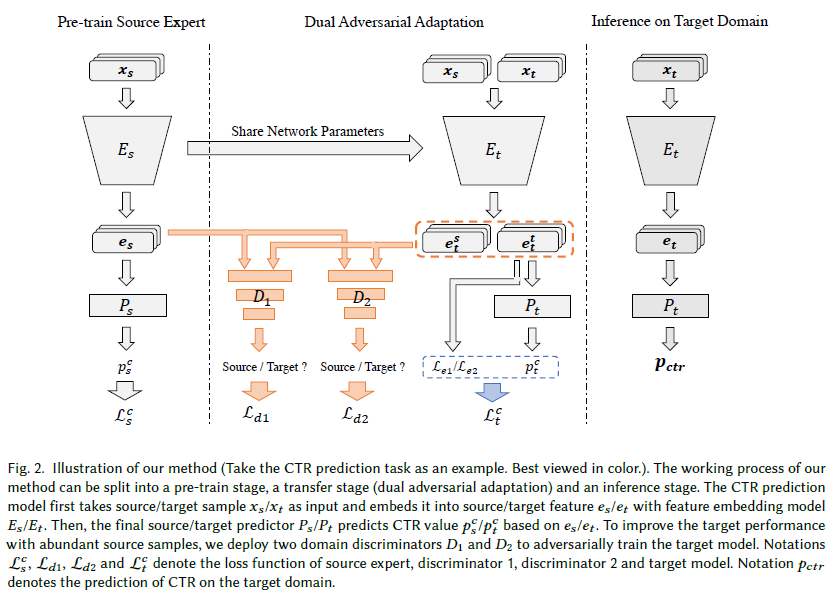

# Cross-domain Recommendation via Dual Adversarial Adaptation in PyTorch

Hongzu Su, Jingjing Li, Zhekai Du, Lei Zhu, Ke Lu, Heng Tao Shen



Abstract: Data scarcity is a perpetual challenge of recommendation systems, and researchers have proposed a variety of cross-domain recommendation methods to alleviate the problem of data scarcity in target domains. However, in many real-world cross-domain recommendation systems, the source domain and the target domain are sampled from different data distributions, which obstructs the cross-domain knowledge transfer. In this paper, we propose to specifically align the data distributions between the source domain and the target domain to alleviate imbalanced sample distribution and thus challenge the data scarcity issue in the target domain. Technically, our proposed approach builds a dual adversarial adaptation (DAA) framework to adversarially train the target model together with a pre-trained source model. Two domain discriminators play the two-player minmax game with the target model and guide the target model to learn reliable domain-invariant features that can be transferred across domains. At the same time, the target model is calibrated to learn domain-specific information of the target domain. In addition, we formulate our approach as a plug-and-play module to boost existing recommendation systems. We apply the proposed method to address the issues of insufficient data and imbalanced sample distribution in real-world Click-Through Rate (CTR)/Conversion Rate (CVR) predictions on two large-scale industrial datasets. We evaluate the proposed method in scenarios with and without overlapping users/items, and extensive experiments verify that the proposed method is able to significantly improve the prediction performance on the target domain. For instance, our method can  boost PLE with a performance improvement of 15.4% in terms of Area Under Curve (AUC) compared with single-domain PLE on our private game dataset. In addition, our method is able to surpass single-domain MMoE by 6.85% on the public dataset.

## Datasets

* AliExpressDataset: This is a dataset gathered from real-world traffic logs of the search system in AliExpress. This dataset is collected from 5 countries: Russia, Spain, French, Netherlands, and America, which can utilized as 5 multi-task datasets. We are unable to provide the processed dataset for copyright reasons, therefore please download the dataset from the original website. [Original_dataset](https://tianchi.aliyun.com/dataset/dataDetail?dataId=74690). 

  You can put the downloaded '.zip' files in `./data/` and run `python preprocess.py --dataset_name NL` to process the dataset.

  To save memory, you can run `python preprocess_memory.py --dataset_name RU` to process the dataset. 

## Preparations

- We provide the pre-trained source models for each method. These methods are pretrained with two NVIDIA RTX 3090s. You can also put your pre-trained models in `./chkpt_src`.
- You can use `make_splits.py` to randomly select target training samples. Selecting samples before training and selecting samples during training yields similar results.


## Requirements

* Python 3.6
* PyTorch > 1.10
* pandas
* numpy
* tqdm

## Run

You can run a model through:

```bash
python main.py --model_name AITM --tgt_dataset_name AliExpress_NL
```

## Acknowledgement

The structure of this code is largely based on [MTReclib](https://github.com/easezyc/Multitask-Recommendation-Library). Thanks for their work.
